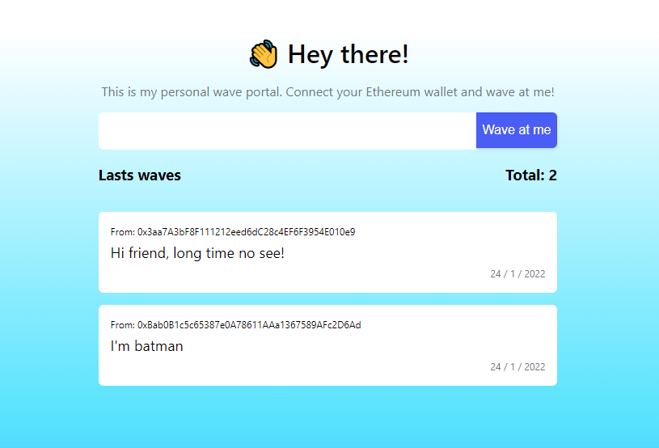

# [swaveportal](https://swaveportal.herokuapp.com/)



This is my personal wave portal, the name stands for sporturno wave portal.

### **[Smart Contract](https://rinkeby.etherscan.io/address/0xafDa0d14Aa2AfF61292704bD442D0FB083eAC25C)**

## Overview

In this webiste anyone on the internet can send me a wave (message) and have that data stored on the blockchain through an Ethereum smart contract. This project was build using HardHat framework and the smart contract was deployed to Rinkeby test network. When a user leaves a message, they have a 50% chance of being rewarded with an amount of ETH. There is also an anti-bot system to prevent spamming where the same account must wait at least 30 (testing purposes).

## Technologies used

- Frontend hosted with [Heroku](https://heroku.com)
- Solidity project with [Hardhat](https://hardhat.org/) framework
- Deployed with [Rinkeby](https://rinkeby.io/#stats) test network
- Contract address: **0xafDa0d14Aa2AfF61292704bD442D0FB083eAC25C**, also check this link: [rinkeby.etherscan](https://rinkeby.etherscan.io/address/0xafDa0d14Aa2AfF61292704bD442D0FB083eAC25C)
- Users must connect using [Metamask](https://metamask.io)

---

## Basic Sample Hardhat Project

This project demonstrates a basic Hardhat use case. It comes with a sample contract, a test for that contract, a sample script that deploys that contract, and an example of a task implementation, which simply lists the available accounts.

Try running some of the following tasks:

```shell
npx hardhat accounts
npx hardhat compile
npx hardhat clean
npx hardhat test
npx hardhat node
node scripts/sample-script.js
npx hardhat help
```
